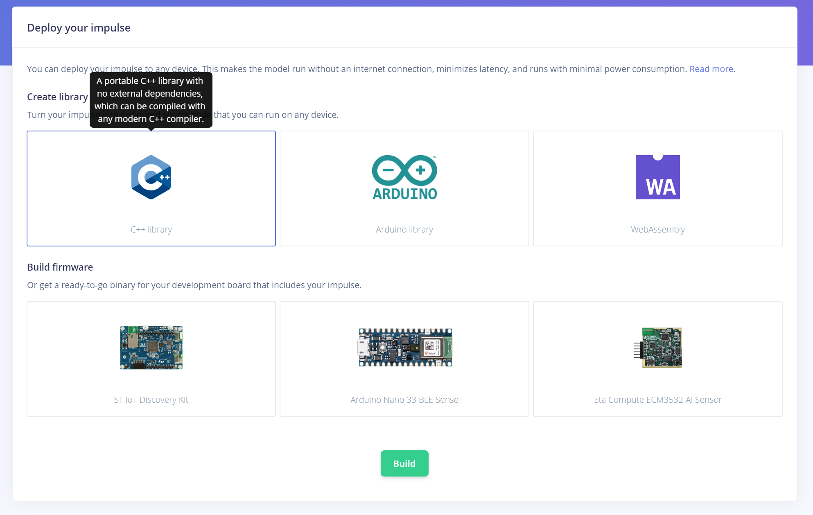

# Edge Impulse on Azure Sphere

This application is an example of Edge Impulse running on an Azure Sphere's RTCore (Cortex-M4F).

Place the `AzureSphereRTCoreToolchainCandCXX.cmake` into the `C:\Program Files (x86)\Microsoft Azure Sphere SDK\CMakeFiles` directory or as appropriate for your Azure Sphere SDK installation.

In order to quickly test with your own model, you should be able to overwrite all the files from this project with the contents of the ZIP file you get from Edge Impulse when exporting as "C++ Library".

If this is the first time you are developing a real-time capable application for Azure Sphere, you will want to make sure to follow the [instructions](https://docs.microsoft.com/en-us/azure-sphere/install/qs-real-time-application) to properly setup your development environment, including a GNU Arm Embedded Toolchain. The application has been tested with the GNU Arm Embedded Toolchain 9 2020-q2-update.

__Note:__ Compile the RTApp in Release configuration so it fits in memory. It seems that only a few tweaks would be needed to actually fit in memory, but that exercise is left to the reader!

__Note 2:__ This sample app will soon get updated with an example HL App (i.e. high-level application, running on the Azure Sphere core that has access to Internet for e.g. IoT communications) to show how the inference results can be sent to Azure IoT. In a nutshell, and if you're interested in exploring on your own in the meantime, read the guidance on how to [implement communication between high-level and real-time cores](https://docs.microsoft.com/en-us/azure-sphere/app-development/inter-app-communication).

## Prerequisites

1. [Seeed MT3620 Development Kit](https://aka.ms/azurespheredevkits) or other hardware that implements the [MT3620 Reference Development Board (RDB)](https://docs.microsoft.com/azure-sphere/hardware/mt3620-reference-board-design) design.
1. A breakout board and USB-to-serial adapter (for example, [FTDI Friend](https://www.digikey.com/catalog/en/partgroup/ftdi-friend/60311)) to connect the real-time core UART to a USB port on your PC. 
1. A terminal emulator (such as Telnet or [PuTTY](https://www.chiark.greenend.org.uk/~sgtatham/putty/) to display the output.
